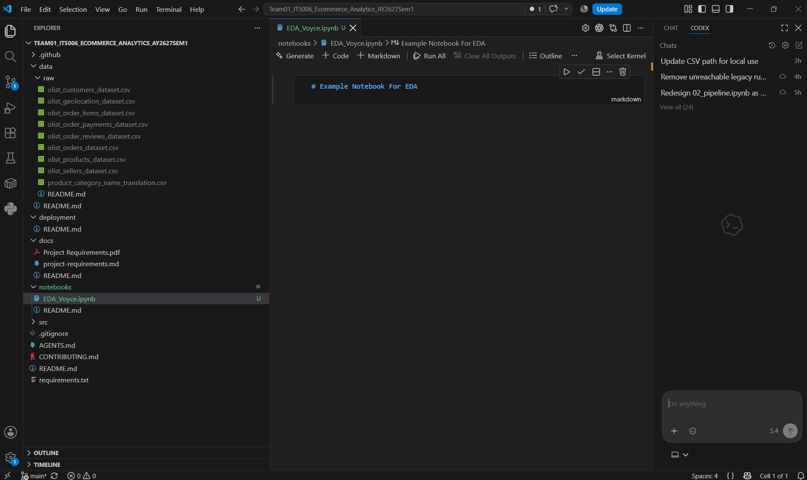

# Contributing

This is a data analytics project, so keep the workflow simple.

## First-time setup

1. Open your IDE, for example VS Code.
2. Clone this repository:

```bash
git clone https://github.com/Voycepeh/Team01_IT5006_Ecommerce_Analytics_AY2627Sem1.git
```

3. Open the cloned repository in your IDE.
4. Use the shared Olist dataset under `data/raw/` when it is available in the repository. If the source files have not yet been added, download the lecturer-provided Olist ZIP from the IT5006 Canvas Week 1 module and extract the CSV files into:

```text
data/raw/
```

The project should look roughly like this:



## Doing your analysis

Use the existing project folders:

| What you are working on | Put it in |
| --- | --- |
| Source, processed and deployment-ready datasets | `data/` |
| EDA, modelling and analysis notebooks | `notebooks/` |
| Reusable Python scripts | `src/` |
| Streamlit, FastAPI, Gradio or Power BI deployment files | `deployment/` |
| Reports, slides, references and other project documents | `docs/` |

For most analysis work, you will mainly work inside `notebooks/` and read source files from `data/raw/`.

## What to upload to GitHub

Upload project files that are needed for collaboration, reproducibility, analysis or deployment. This can include notebooks, Python scripts, reports, documentation, deployment files and project data.

Data may be committed when it forms part of the project workflow, including:

- the lecturer-provided Olist source files under `data/raw/`
- cleaned or processed datasets used by shared analysis
- dashboard-ready datasets required by Streamlit or another deployed application
- model-ready datasets when the team agrees they are useful for reproducibility

Keep original source files unchanged where practical. Do not overwrite the raw Olist CSVs with transformed data.

Avoid committing disposable or unnecessary data artifacts such as duplicate exports, temporary files, cache files, ad hoc intermediate outputs or multiple copies of the same dataset. The repository `.gitignore` excludes common temporary data locations.

Before committing, use `git status` to confirm that the files belong to the project workflow.

## Working with the team

If you are making changes, use your own branch where practical and submit your work back to the repository for the team to review. Do not overwrite or delete another teammate's work without agreement.

Keep changes focused on the task you are working on.

Never commit passwords, tokens, API keys or other secrets.

## AI-assisted work

AI tools may assist with the project where consistent with the course requirements. Human teammates remain responsible for reviewing, understanding and validating AI-assisted work before submission.

AI agents must follow [`AGENTS.md`](AGENTS.md).

## Project requirements

Before making scope or deliverable decisions, check [`docs/project-requirements.md`](docs/project-requirements.md).

Official course page:
https://prakashsukhwal.github.io/IT5006/IT5006_Project_Description_2026Aug_V2.html#project-timeline-deliverables

If local documentation differs from the latest official course page or Canvas announcement, follow the latest official course source.
