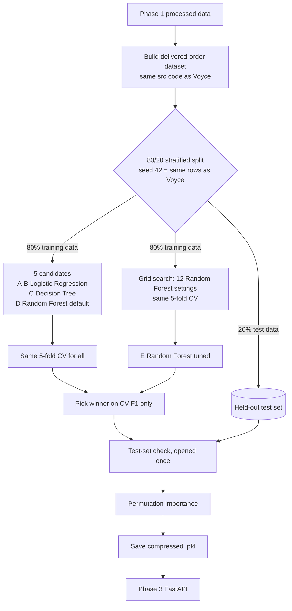

# Phase 2 — Tree-Based Model (Random Forest) for Delivered-Order Negative Reviews

This page covers **only the tree-based model work**: the second Phase 2 model family. It explains what was built, the results, and which files changed. It is written for teammates reviewing the work **and** for any AI assistant (Claude Code or similar) that picks this branch up later.

* **Branch:** `feature/delivered-order-random-forest`
* **Builds on:** Voyce's Logistic Regression workflow for all delivered orders: [`notebooks/phase2_delivered_order_negative_review_classification.ipynb`](notebooks/phase2_delivered_order_negative_review_classification.ipynb) and [`docs/phase2-delivered-order-classification-workflow.md`](docs/phase2-delivered-order-classification-workflow.md).
* **Out of scope:** the regression problem (owned by the other half of the team) and the late-order-only formulation (the team chose all delivered orders for classification).
* **Status:** run end-to-end and checked by the author's AI assistant. **The team still has to review it** before merge and before anything goes into the Phase 2 report.

---

## Where to read things (reading order)

| # | What | Why read it |
|---|---|---|
| 1 | This file | The overview, results and file changes |
| 2 | [`notebooks/phase2_delivered_order_random_forest_classification.ipynb`](notebooks/phase2_delivered_order_random_forest_classification.ipynb) | The full analysis. Every step has an **"In plain words"** note, and outputs are saved in the notebook, so you can read it without re-running |
| 3 | Section 10 of that notebook | The ready-made summary for the Phase 2 report: comparison table, final selection, insights and limitations |
| 4 | [`notebooks/phase2_delivered_order_negative_review_classification.ipynb`](notebooks/phase2_delivered_order_negative_review_classification.ipynb) | Voyce's Logistic Regression baseline, which this work compares against (unchanged) |
| 5 | [`src/classification_tree_model.py`](src/classification_tree_model.py) | The reusable Decision Tree / Random Forest pipeline code |

Open notebooks in VS Code (Jupyter extension) or on GitHub. Both show the saved outputs and charts.

---

## Question

**For any completed delivered order, can we predict whether the customer will leave a negative review (1–2 stars)?** This is the same question, population and target as Voyce's notebook.

* **Target:** `1` = review score 1–2, `0` = review score 3–5.
* **Population:** 95,824 delivered orders that have a customer-delivery date and a recorded review. 12.8% are negative.
* **Prediction point:** right after delivery, before the review is written.
* **Stakeholder:** the customer-experience team, who can contact at-risk customers before they post a review.

## Big picture



## What the notebook does

1. Loads `data/processed/order_level.csv` and `item_level.csv` and builds the dataset with Voyce's `build_delivered_order_classification_dataset(...)`.
2. Makes the **same 80/20 stratified split with seed 42**, so the train and test rows are identical to Voyce's notebook.
3. Defines 5 candidate models (table below).
4. Scores candidates A–D with the **same 5-fold stratified cross-validation** on training data only.
5. Tunes the Random Forest with `GridSearchCV` (12 settings × 5 folds = 60 forests) to get candidate E.
6. Picks the winner by **highest mean CV F1**. This rule was fixed before the test set was opened.
7. Fits every candidate on the full training set and evaluates each **once** on the test set at the fixed 0.50 cut-off.
8. Explains the Random Forest with **permutation importance** on the 21 original input columns.
9. Saves the tuned Random Forest to `deployment/delivered_order_random_forest_pipeline.pkl` with the team's artifact function.
10. Writes a summary for the Phase 2 report.

## The five candidates

| | Candidate | Family | Why it is included |
|---|---|---|---|
| A | Logistic Regression (baseline) | Linear | Voyce's existing baseline, unchanged |
| B | Logistic Regression (`class_weight="balanced"`) | Linear | **Fairness check.** It gets the same imbalance help as the forest, so any forest win comes from the model and not from the weighting |
| C | Decision Tree (default) | Tree | Simplest tree, the tree family's baseline (the brief asks for the simplest variant first) |
| D | Random Forest (default, 200 trees) | Tree | Tests whether averaging many trees fixes the single tree's overfitting |
| E | Random Forest (tuned) | Tree | Settings chosen by grid search |

**Class imbalance in plain words:** only about 1 in 7 orders gets a negative review. A model left alone learns to be cautious and misses most of them. Class weighting makes a missed negative review count about 7× more (the actual ratio is 1 : 6.8).

## Preprocessing

Same as the Logistic Regression pipeline **except that numbers are not scaled**, because trees split on raw values (for example "is `delivery_days` > 20?"):

* Numeric columns: median imputation.
* Categorical columns: most-frequent imputation, then one-hot encoding with `handle_unknown="ignore"`.
* Everything sits inside one scikit-learn `Pipeline`, so it is learned from training folds only (no leakage).
* The feature contract is unchanged: `DELIVERED_MODEL_FEATURES` from `src/classification_data.py` (15 numeric + 6 categorical columns; IDs and review fields excluded).

## Hyperparameter tuning

| Setting | Values tried | Meaning |
|---|---|---|
| `max_depth` | 12, no limit | How many questions deep each tree may go |
| `min_samples_leaf` | 10, 25, 50 | Minimum training orders in each end-point. Larger values stop trees memorising orders |
| `class_weight` | none, `balanced_subsample` | Whether missed negative reviews count extra |

`n_estimators` is fixed at 200 (more trees only stabilises the average). Scoring uses mean F1 (`refit="f1"`), and precision, recall, PR-AUC and ROC-AUC are recorded too.

**Chosen settings:** 200 trees, `max_depth=None`, `min_samples_leaf=10`, `class_weight="balanced_subsample"`.

**Grid finding:** class weighting is the biggest lever. All 6 balanced settings (CV F1 0.448–0.469) beat all 6 unweighted settings (0.396–0.412).

## Results

### Cross-validation (training data, 5 folds; the winner is chosen here)

| Candidate | CV F1 | F1 std | Precision | Recall | PR-AUC | ROC-AUC |
|---|---|---|---|---|---|---|
| A. Logistic Regression (baseline) | 0.422 | 0.011 | 0.660 | 0.310 | 0.438 | 0.750 |
| B. Logistic Regression (balanced) | 0.433 | 0.006 | 0.367 | 0.528 | 0.435 | 0.753 |
| C. Decision Tree (default) | 0.321 | 0.008 | 0.310 | 0.334 | 0.189 | 0.612 |
| D. Random Forest (default) | 0.422 | 0.012 | 0.723 | 0.298 | 0.466 | 0.756 |
| **E. Random Forest (tuned)** | **0.469** | 0.006 | 0.456 | 0.482 | **0.475** | **0.766** |

### Held-out test set (19,165 orders, cut-off 0.50)

| Candidate | Precision | Recall | F1 | Balanced accuracy | PR-AUC | ROC-AUC |
|---|---|---|---|---|---|---|
| A. Logistic Regression (baseline) | 0.646 | 0.315 | 0.423 | 0.645 | 0.431 | 0.748 |
| B. Logistic Regression (balanced) | 0.362 | 0.538 | 0.433 | 0.700 | 0.429 | 0.753 |
| C. Decision Tree (default) | 0.317 | 0.343 | 0.330 | 0.617 | 0.193 | 0.617 |
| D. Random Forest (default) | 0.701 | 0.314 | 0.433 | 0.647 | 0.462 | 0.757 |
| **E. Random Forest (tuned)** | 0.451 | 0.494 | **0.472** | **0.703** | **0.477** | **0.764** |

* Candidate A reproduces Voyce's notebook results exactly, which confirms the same rows are used.
* The tuned forest's test F1 (0.472) matches its CV F1 (0.469), so it was not over-tuned.

### In real orders (test set)

| | Orders flagged | Real negative reviews caught | Flags that were correct | Share of all 2,454 negative reviews caught |
|---|---|---|---|---|
| A. Logistic Regression (baseline) | 1,197 | 773 | 65% | 31% |
| E. Random Forest (tuned) | 2,686 | 1,212 | 45% | 49% |

The forest catches 439 more unhappy customers but raises more false alarms. That is the precision/recall trade-off, and the cut-off can be raised in Phase 3 if the customer-experience team has limited capacity.

## Analysis

### What the comparison shows

* **A single Decision Tree overfits** (PR-AUC 0.19, barely above the 0.13 that guessing would give).
* **Averaging 200 trees fixes that.** The default forest already ranks orders better than Logistic Regression (PR-AUC 0.466 vs 0.438 in CV), but without weighting it is too cautious (recall 0.30).
* **Weighting does not improve Logistic Regression's ranking** (CV PR-AUC 0.438 → 0.435). It only moves where the line is drawn.
* **The tuned forest wins by a real margin.** CV F1 is 0.469 vs 0.433 for the best Logistic Regression. The 0.036 gap is about 6× the fold-to-fold variation (0.006).
* **The more complex model earns its place**, as the project brief requires: C → D → E each improve on the previous step.

### What the Random Forest relies on (permutation importance, test set)

Each column is shuffled 5 times and the average drop in test PR-AUC is measured.

| Column | PR-AUC drop |
|---|---|
| `days_early` (positive = early, negative = late) | 0.101 |
| `late_delivery_flag` | 0.040 |
| `delivery_days` | 0.038 |
| `item_count` | 0.034 |
| `customer_state` | 0.008 |
| Every other column | ≤ 0.005 (payment details and purchase weekday ≈ 0) |

* **Delivery against the promised date dominates.** The three timing columns share information, so each one looks less important alone than timing is as a group.
* **`item_count` is the strongest non-timing signal.** One possible reason is split or incomplete multi-item deliveries, but that is a hypothesis to check, not a finding.
* This differs from Logistic Regression's coefficient table, where rare product categories and states had the largest coefficients. A big coefficient on a rare category does not mean that column matters across all orders.
* These are associations, not causes.

## Final selection

**Tuned Random Forest (E)**, because:

1. it has the best cross-validation F1, by a margin well beyond fold noise, chosen before the test set was opened;
2. it has the best ranking quality (PR-AUC, ROC-AUC) on unseen orders; and
3. it beats Logistic Regression even when both get the same imbalance help.

Logistic Regression stays as the simpler, more explainable baseline.

## Actionable insights for the customer-experience team

* **Act right after delivery, starting with late orders.** Delivery against the promised date is the strongest warning sign.
* **Watch multi-item orders.** After timing, the number of items is the clearest risk signal.
* **Size the cut-off to team capacity.** At 0.50 the model flags about 14% of orders and catches about half of the negative reviews, with 45% of flags correct (13% would be correct by chance).
* **Delivery is the lever the business controls.** Payment details and purchase weekday add essentially nothing.

## Limitations

* **The risk score is not a true probability.** Class weighting pushes scores upward. Use the output as a ranking/risk score, or calibrate it first.
* **Fixed 0.50 cut-off**, not tuned.
* **The tuned CV score is slightly optimistic** (best of 12 settings on the same folds). The test set confirms it holds.
* **The best `min_samples_leaf` (10) is at the edge of the grid.** A follow-up could also try 5.
* **Only reviewed orders.** 99.3% of delivered orders have a review, so the model predicts risk *given that a review is written*.
* **The overall signal is moderate.** The best model still misses about half of the negative reviews, because product quality and expectations are not in the data.
* **The model file is larger.** The `.pkl` is 22.8 MB compressed, against about 10 KB for Logistic Regression.

## Phase 3 handoff

* **File:** `deployment/delivered_order_random_forest_pipeline.pkl` (22.8 MB, joblib `compress=3`).
* **Format:** identical to Voyce's `delivered_order_negative_review_pipeline.pkl`, a dict with `artifact_version`, `pipeline`, `threshold` (0.50), `model_features`, `prediction_point`, `model_scope="all_delivered_orders"` and `metadata`. The metadata includes the chosen settings, CV F1, test metrics, seed and `sklearn_version`.
* **Loading:** works the same way for either model:

```python
import joblib
from src.classification_model import predict_from_delivered_order_artifact

artifact = joblib.load("deployment/delivered_order_random_forest_pipeline.pkl")
predictions = predict_from_delivered_order_artifact(artifact, records)  # records has DELIVERED_MODEL_FEATURES
```

* **Labelling:** the API should present `negative_review_probability` from this model as a **risk score** (see limitations).

---

## Files changed on this branch

### New files

| File | Details |
|---|---|
| `notebooks/phase2_delivered_order_random_forest_classification.ipynb` | The new analysis notebook (24 cells, saved with outputs). Sections: 1 load and split · 2 how trees work · 3 five candidates · 4 cross-validation · 5 grid search · 6 pick the winner · 7 test set and confusion matrices · 8 permutation importance and chart · 9 save the `.pkl` · 10 report summary. Each step has an "In plain words" explanation. Voyce's notebook is **not** modified. |
| `src/classification_tree_model.py` | Reusable tree-family code. `build_tree_preprocessor()` does median imputation for numbers (no scaling) and most-frequent imputation plus one-hot encoding for categories, using `DELIVERED_NUMERIC_FEATURES` and `DELIVERED_CATEGORICAL_FEATURES`. `build_delivered_order_decision_tree_pipeline(random_state)` builds a default `DecisionTreeClassifier`. `build_delivered_order_random_forest_pipeline(random_state, n_estimators=200, n_jobs=-1)` builds a `RandomForestClassifier` with other settings left at their defaults so `GridSearchCV` can tune `classifier__*`. |
| `tests/test_classification_tree_model.py` | Two pytest tests on tiny synthetic data (reusing `make_inputs()` from `test_classification_foundation.py`): (1) tree preprocessing leaves numeric values unscaled; (2) a Random Forest pipeline saves with `compress=3`, reloads, and scores through `predict_from_delivered_order_artifact`. |
| `deployment/delivered_order_random_forest_pipeline.pkl` | The fitted tuned Random Forest pipeline and its inference contract, made by section 9 of the notebook with scikit-learn 1.9.0. |
| `PHASE2_TREE_MODEL.md` | This file. |

### Modified files

| File | Details |
|---|---|
| `src/classification_model.py` | Added an optional `compress: int = 0` argument to `_save_inference_artifact(...)` and `save_delivered_order_inference_artifact(...)`, passed to `joblib.dump(..., compress=compress)`, plus a docstring note. **The default is unchanged**, so Voyce's existing calls and `.pkl` files behave exactly as before. Reason: the uncompressed forest was 60 MB, over GitHub's 50 MB warning size. |
| `src/README.md` | Added one bullet describing `classification_tree_model.py`. |

No other files were changed. Voyce's notebook, Voyce's `.pkl`, `classification_data.py`, `classification_evaluation.py` and `requirements.txt` are untouched.

## How to reproduce

```bash
pip install -r requirements.txt pytest
python -m pytest -q tests/test_classification_tree_model.py tests/test_classification_foundation.py   # 9 passed
# then run the notebook top to bottom (about 11–12 minutes on a 12-core laptop; the grid search takes about 7)
```

Results are deterministic: all seeds are 42, and two full runs gave identical numbers.

**Environment note.** Voyce's `.pkl` files were made with scikit-learn **1.9.1**. On the author's Windows 11 laptop, Smart App Control blocked the brand-new 1.9.1 binaries, so this work used **1.9.0** (same 1.9 line, so the pickles are compatible). scikit-learn 1.7.x does **not** work here because it cannot handle pandas 3's string columns. If you hit `DLL load failed ... Application Control policy`, install `scikit-learn==1.9.0`.

---

## Notes for AI assistants continuing this work

Follow the same pattern as this branch and Voyce's workflow:

1. **Read first:** `AGENTS.md`, `docs/project-requirements.md`, then this file.
2. **Same data, same split:** always use `build_delivered_order_classification_dataset(...)`, `split_delivered_order_features_target(...)`, `train_test_split(test_size=0.20, stratify=y, random_state=42)` and `StratifiedKFold(n_splits=5, shuffle=True, random_state=42)`. Do not change the feature contract without team approval.
3. **Reusable code goes in `src/`**, notebooks call it and explain it. Add a pytest test for new `src/` code.
4. **Choose models on cross-validation only.** Open the test set once, at the end, and never tune or choose with it.
5. **Do not modify a teammate's notebook.** Create a new notebook for new work, as this branch did.
6. **Explain simply.** Each notebook step gets an "In plain words" note. Interpretation text must quote numbers actually produced by the notebook. Never invent results.
7. **Save models** with `save_delivered_order_inference_artifact(...)` under a new file name in `deployment/`. Use `compress=3` for large models.
8. **Commit notebooks with outputs** after a full top-to-bottom run, and update this file if results change.
9. **Project limits:** 2–3 model families in total. This project now uses Linear (Logistic Regression) and Tree (Decision Tree / Random Forest). A third family is optional and must be justified.
10. Work on a branch, open a PR, and do not merge to `main` unless a human asks.

## Open items for the team

* Review and agree on the final selection (tuned Random Forest) before it goes in the Phase 2 report.
* Optional: extend the grid to `min_samples_leaf=5`.
* Decide how Phase 3 presents the score (risk score vs calibrated probability) and whether to change the 0.50 cut-off.
* Declare AI assistance in the report as the course requires.
