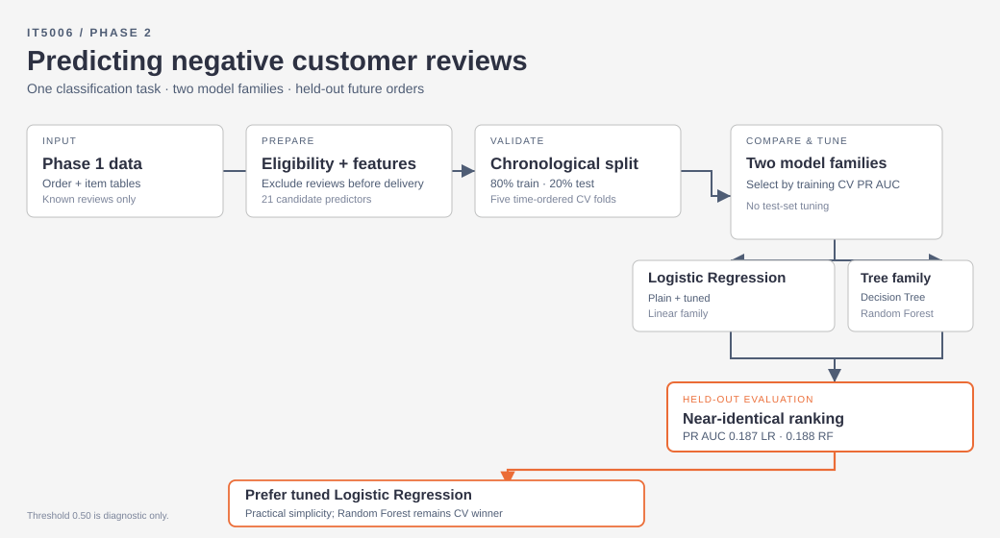

# Phase 2: Negative review classification workflow

**Question:** Can we identify delivered orders likely to receive a negative review (1–2 stars) **after delivery and before review submission**?

We analyse historical Olist orders to support potential follow-up by customer experience and seller quality teams. The [final classification notebook](../notebooks/phase2_delivered_order_classification_final.ipynb) contains the implementation, saved figures and detailed results.

## Method at a glance

| Stage | Our approach |
|---|---|
| Population and target | One row per delivered order with a known review; exclude orders reviewed before delivery. Target: 1–2 stars = negative, 3–5 stars = non-negative. |
| Features | 21 candidate predictors from delivery performance, order/payment value, order and seller complexity, product characteristics, geography and purchase timing. |
| Splitting | Earlier 80% of purchases for training and validation; newest 20% held out for final testing. Five forward-chaining validation folds within training. |
| Models | Logistic Regression, Decision Tree and Random Forest: **two model families**, starting with simple baselines. |
| Evaluation | Average precision (reported as PR AUC) is primary because negative reviews are uncommon. We also examine ROC AUC, threshold-based precision/recall/F1 and overfitting. |
| Selection | Tune Logistic Regression and Random Forest using training-only CV; apply the **one-standard-error rule** to prefer a simpler model when its validation PR AUC is close to the best. |
| Decision threshold | Choose on out-of-fold validation predictions, **before** testing: maximise recall while maintaining at least 20% precision in an illustrative contact scenario. |
| Final check | Evaluate the frozen model and cutoff once on later held-out orders, then interpret errors, predictive signals and limitations. |

**Prediction timing matters.** Delivery duration and lateness can be used because the prediction happens after delivery. Review scores, text and timestamps are not predictors; timestamps only help establish historical eligibility. The split uses purchase time, which is not a complete reconstruction of when every label became available.

## Main results

| Metric | Tuned Logistic Regression | Tuned Random Forest |
|---|---:|---:|
| Validation PR AUC | 0.218 | **0.229** |
| Training PR AUC | 0.193 | 0.334 |
| Held-out test PR AUC | 0.187 | 0.188 |
| Held-out test ROC AUC | **0.649** | 0.645 |
| Selected validation cutoff | 0.12 | 0.12 |
| Test precision at 0.12 | **24.8%** | 18.6% |
| Test recall at 0.12 | 22.2% | **34.0%** |
| Test false alarms at 0.12 | **1,042** | 2,297 |

**Why Logistic Regression?** Its validation PR AUC is within one standard error (**0.020**) of the forest's best score. Under our stated one-standard-error rule, the forest's small gain does not justify additional complexity. Logistic Regression also shows a smaller training–validation gap. On the held-out test period, the two models' ranking results are nearly identical.

**Why 0.12 instead of 0.50?** A cutoff of 0.50 detects only **2.3%** of negative reviews with tuned Logistic Regression. Using validation predictions, **0.12** is the lowest cutoff meeting our illustrative **20% precision** floor, with **21.6% precision** and **36.0% recall** on combined validation folds. On later test orders, the frozen cutoff delivers **24.8% precision** and **22.2% recall**, flagging **1,385 orders (7.6%)** and finding **343** negative reviews. The forest's test precision drops below the policy floor to **18.6%**.

The threshold controls whom to contact; it **does not change PR AUC or ROC AUC**. The 20% floor is a teaching scenario, **not an approved business requirement**. Validation precision also varies over time, so these values should not be treated as guaranteed operating performance.

## Additional check: does rebalancing help?

We separately compared three Logistic Regression training approaches: natural class distribution, balanced class weights, and 50/50 random undersampling. This sensitivity experiment used a **64% fit / 16% validation / 20% test** chronological partition, selected thresholds by **validation F1**, and applied undersampling only to training data. Its design differs from the main five-fold CV analysis, so results are **not directly interchangeable**.

| Training approach | Test PR AUC | Test ROC AUC | Validation cutoff | Test precision | Test recall | Test F1 |
|---|---:|---:|---:|---:|---:|---:|
| Natural | **0.1812** | 0.6440 | 0.13 | 23.17% | 22.75% | 0.2296 |
| Balanced weights | 0.1793 | **0.6460** | 0.57 | 22.29% | **24.63%** | **0.2340** |
| 50/50 undersampling | 0.1778 | 0.6413 | 0.58 | **23.29%** | 22.49% | 0.2288 |

Neither balancing approach improved test PR AUC over natural training; the F1 differences were small. We therefore **do not change the main model selection** based on this experiment. This does not imply that class imbalance has no effect.

Reproduce this check with the [experiment script](../scripts/compare_phase2_class_balance.py) and [recorded results](../reports/phase2/three_approaches.csv).

## Stakeholder interpretation and limitations

At the chosen cutoff, Logistic Regression identifies **about 22%** of negative reviews, but **roughly three in four flagged orders are false alarms**. Order and seller complexity, followed by delivery duration, are its strongest predictive signals; these associations do **not** demonstrate causation or establish that outreach will improve reviews.

Our analysis excludes **4,653** orders reviewed before delivery, and some dissatisfaction drivers are absent from Olist. Purchase-time splitting does not fully simulate label availability. Model scores and the effective cutoff can change across periods. Tuning and threshold selection use the same validation folds, so validation results may be optimistic, while the final test period was not used to make those choices.

**Next step:** Agree an actual contact capacity or intervention cost with the stakeholder, select a threshold on validation data for that policy, and monitor precision and contact volume on recent orders before deployment.

For methods, figures, model errors and references, see the [classification notebook](../notebooks/phase2_delivered_order_classification_final.ipynb). The model-selection rule follows Hastie, Tibshirani and Friedman (2009), *The Elements of Statistical Learning*, section 7.10.
