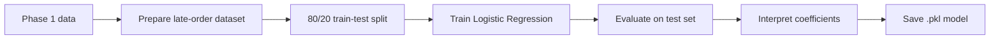

# Phase 2 — Negative Review Classification

This page explains the simple Logistic Regression workflow used in the Phase 2 notebook.

## Question

**Among orders that were delivered late, can Logistic Regression predict which customers are likely to give a negative review (1–2 stars)?**

**Target:** `1` = review score 1–2; `0` = review score 3–5.

**Population:** delivered orders that were late and subsequently received a review.

**Prediction point:** immediately after the late delivery is completed and before the customer's review is known.

## Big Picture

That is the whole modelling story. The notebook deliberately avoids model tournaments, class-weight variants, out-of-fold prediction logic and threshold optimisation.

## What the Notebook Does

1. Loads the processed Phase 1 order and item data.
2. Keeps late, delivered orders with a known review outcome.
3. Creates the binary negative-review target.
4. Uses an explicit feature list and excludes review-side information and IDs.
5. Splits the data into 80% training and 20% test data using a fixed random seed and stratification.
6. Builds one scikit-learn Pipeline containing preprocessing and Logistic Regression.
7. Runs 5-fold cross-validation on the training data as the project's required model-validation check.
8. Fits the Logistic Regression model on the full training set.
9. Evaluates it once on the test set using the standard 0.50 classification cutoff.
10. Interprets the strongest positive and negative Logistic Regression coefficients.
11. Saves preprocessing + Logistic Regression together as `deployment/negative_review_logistic_pipeline.pkl`.

## Why the Feature Selection Matters

The model predicts after a late delivery has completed but before the customer submits a review. Delivery information is therefore available, while review IDs, review text and review timestamps are not valid predictors.

The feature list is explicitly defined in `src/classification_data.py`. Order, customer, product and seller IDs are excluded to avoid learning individual identities rather than useful patterns.

## Preprocessing

Preprocessing stays inside the scikit-learn Pipeline so the same transformations are used during training and later prediction.

Numeric features use median imputation and standardisation. Categorical features use most-frequent imputation and one-hot encoding.

## Cross-Validation

The project requires cross-validation. The notebook uses 5-fold cross-validation only as a straightforward training-data validation check.

The training data is divided into five parts. The model trains on four parts and validates on the remaining part, repeating until each part has been used for validation once. The notebook displays the five F1 scores and their mean.

Cross-validation does not select between multiple Logistic Regression variants and does not tune the classification threshold.

## Test Evaluation

After the validation check, the Pipeline is fitted using the full training set and evaluated on the untouched 20% test set.

The model keeps Logistic Regression's standard probability cutoff of **0.50**. The notebook reports Precision, Recall, F1, balanced accuracy, PR-AUC and ROC-AUC, plus a classification report and confusion matrix.

These results are the evidence used to discuss whether the hypothesis is supported and how useful the simple model is. Weak predictive performance is still a valid academic result and should be reported rather than tuned away using the test set.

## Interpretation

The notebook reports the strongest positive and negative Logistic Regression coefficients and their odds ratios.

A positive coefficient is associated with higher odds of a negative review, while a negative coefficient is associated with lower odds. These are associations, not causal effects.

## Phase 3 Handoff

There is no need for a deployment flowchart. The handoff is simply:

* The Phase 2 notebook trains and evaluates the model.
* It saves **Preprocessor + Logistic Regression in one `.pkl` file** at `deployment/negative_review_logistic_pipeline.pkl`.
* Phase 3 FastAPI loads that approved file.
* `POST /predict` validates the required order features, runs the saved Pipeline and returns the negative-review probability and predicted class.
* FastAPI serves the trained model. It does not retrain or tune it.

## Feature Contract

The exact feature lists in `src/classification_data.py` are authoritative.

| Information | Treatment | Why |
| --- | --- | --- |
| Review score | Target only | Defines negative vs non-negative review |
| Review ID, comments and timestamps | Excluded | Outcome-side leakage |
| Order/customer/product/seller IDs | Excluded | Avoid entity memorisation |
| Order status and late flag | Cohort filter only | Defines the modelling population |
| Delivery timing including `days_early` | Predictor | Known at the prediction point |
| Item, value, freight and seller counts | Predictor | Order characteristics |
| Payment information | Predictor | Order characteristics |
| Customer/seller geography | Predictor | Coarse location information |
| Purchase month/weekday | Predictor | Temporal context |
| Product category and physical attributes | Predictor | Product characteristics |

## Outputs to Review

After running the notebook from top to bottom, review the target balance, five cross-validation F1 scores, final test metrics, confusion matrix and coefficient table. These outputs provide the evidence for the Phase 2 report.

The notebook should be committed with its final execution outputs once the team has run and reviewed the approved version.
