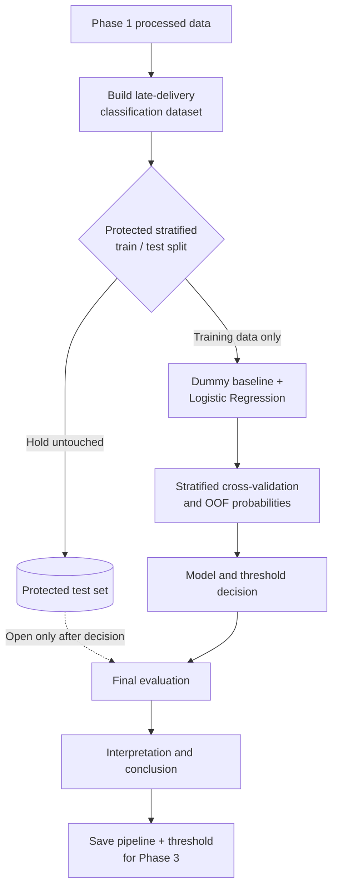

# Phase 2 classification workflow

## Big Picture

**Research question:** Among orders delivered late, can we predict which are likely to
receive a negative customer review (1 or 2 stars)?

**Class being predicted: Negative review**

- `1` = review score 1–2
- `0` = review score 3–5

**Population being studied:** Orders that were delivered late and subsequently received a
review.

**Key explanatory feature:** How late the delivery was. Phase 1 records this using
`days_early`, where negative values represent late deliveries. For example, `-1` means 1 day
late and `-10` means 10 days late.

**Why this matters:** Not every late delivery receives a negative review. The model
investigates whether the severity of lateness, together with other eligible order
characteristics, can distinguish late deliveries that are more likely to receive a negative
review.

Late delivery is therefore the population filter, not the class being predicted. Once a late
order arrives, the customer-experience team can use the estimated negative-review risk to
prioritise recovery or outreach. The prediction point is immediately after the late delivery
is completed and before the review is known. Delivery performance can therefore be used, but
nothing from the review except its score may enter target construction.

The first model family is Logistic Regression. It is suitable as a transparent course-level
baseline, supports probability estimates and allows coefficient/odds-ratio interpretation.
This foundation does not report a fitted result or select a final threshold: those are team
analytical decisions that must be produced by running and reviewing the canonical notebook.
No second classification model family is introduced here.

Phase 1 already provides cleaned analytical CSVs at order and item grain. Phase 2 adds a
classification-only model table, a leakage-safe sklearn pipeline, evaluation/threshold
helpers, and a versioned inference bundle contract. It does **not** rebuild general Phase 1
cleaning, consume `dashboard_orders.parquet`, or implement the Phase 3 application.

## Inputs and Outputs

| Component | Receives | Returns / persists |
| --- | --- | --- |
| `build_classification_dataset` | Phase 1 `order_level.csv` (one row/order) and `item_level.csv` (one row/order item) | One row per late, delivered, reviewed order; trace-only `order_id`, explicit model features, binary target |
| `split_features_target` | Contracted classification dataset | `X` containing only the allow-listed features and binary `y` |
| `build_preprocessor` | Numeric and categorical columns named in `classification_data.py` | Unfitted `ColumnTransformer`; median imputation/scaling and mode imputation/OHE are learned only during fitting |
| `build_logistic_pipeline` | Contracted feature frame at `.fit()` | Unfitted end-to-end Logistic Regression pipeline |
| Evaluation helpers | True labels and probabilities from validation/OOF folds | Metric dictionary, threshold comparison table, or optional statistical candidate; no automatic operating decision |
| `save_inference_artifact` | Reviewed fitted pipeline, training-only selected threshold and optional provenance | Joblib dictionary with schema version, exact feature contract, prediction point and metadata |
| `predict_from_artifact` | Loaded artifact and one or more model-feature rows | Negative-review probability and thresholded prediction |

The authoritative detailed dataset contract is the `build_classification_dataset()`
docstring. The inference artifact should only be produced after the team has frozen the
model, threshold and provenance metadata (for example, data version, commit and metrics).
Model binaries are generated outputs and are not added by this foundation PR.

## Under the Hood

### Eligibility, grain and target

- Eligible examples are delivered orders with a non-null customer-delivery timestamp,
  Phase 1 `late_delivery_flag == 1` and a deduplicated review score. This is the
  retrospective population needed to construct the target; review-answer timing does not
  silently remove otherwise usable observations.
- Phase 1 defines `days_early = estimated delivery date - actual delivery date`: positive
  means early, zero means on the promised day and negative means late. The builder validates
  that `late_delivery_flag` agrees with this convention and carries `days_early` through
  unchanged as the initial lateness-severity candidate.
- Lateness bands are not separate targets or separate models. The target remains negative
  review yes/no, while lateness severity is one input to the same Logistic Regression.
- `review_timing_audit()` separately counts missing, unparseable, at/before-delivery and
  after-delivery review answers. These outcome-side fields support data-quality discussion
  only and are never predictors.
- `order_id` must be unique in the order input; (`order_id`, `order_item_id`) must be unique
  in the item input; every eligible order must have item coverage.
- Review score must be one of 1–5. Scores 1–2 map to target 1; scores 3–5 map to target 0.
- Both target classes must be present. Required columns, duplicate keys and infinite numeric
  values fail early rather than silently changing the modelling population.

### Features and leakage controls

Features are allow-listed as `NUMERIC_FEATURES` and `CATEGORICAL_FEATURES`; the code never
uses “all columns except target.” IDs and post-review fields cannot silently enter the model
when an upstream CSV gains a column. Order-level payment, geography, temporal, value and
delivery features are combined with deterministic item-derived product summaries. A
multi-category order uses the category with greatest item value, with alphabetical tie-break.

Deterministic business transformations occur before splitting because they learn no sample
statistics. Median/mode imputation, scaling and one-hot category discovery remain inside the
sklearn Pipeline, so cross-validation fits them separately in each training fold.

The test partition must be created once with a fixed seed and target stratification, then
left untouched until all refinement and threshold choices are complete. Threshold selection
uses out-of-fold probabilities from training data only. Accuracy is not a sufficient primary
metric for an imbalanced target; compare precision, recall, F1, balanced accuracy and PR-AUC,
with ROC-AUC as supporting context. The business cost of missed negative reviews versus
unnecessary outreach must determine the final selection rule.

`threshold_table()` is the primary analysis interface. `best_threshold_by_metric()` may
identify a statistical candidate, such as the maximum-F1 row, but it does not select the
operating threshold. The team must make and document that decision from stakeholder costs;
the protected test set cannot participate in it.

### Feature contract and audit

This table covers the actual Phase 1 fields used to construct the **initial candidate feature
set** and the important exclusions. The team must review this set before modelling. Grouped
rows share the same treatment and rationale; the exact current allow-list remains
authoritative in `NUMERIC_FEATURES` and `CATEGORICAL_FEATURES`.

| Feature | Source | Treatment | Available at prediction point? | Model input? | Reason |
| --- | --- | --- | --- | --- | --- |
| `review_score` | `order_level` / deduplicated reviews | Target only | No | Target only | Constructs 1 for scores 1–2 and 0 for 3–5; never enters `X` |
| `review_id`, review comments | `order_level` / reviews | Excluded leakage | No | No | Exist only with the review outcome and could reveal it |
| `review_creation_date`, `review_answer_timestamp`, `days_to_review_request` | `order_level` / reviews | Excluded leakage | No | No | Outcome-side timing is audit context, not predictive input |
| `order_id` | `order_level` | Excluded identifier | Yes | No | Retained only to trace errors and joins |
| `customer_id`, `customer_unique_id`, `product_id`, `seller_id` | processed source tables | Excluded identifier | Yes | No | High-cardinality entity keys risk memorisation and are not deployable signals here |
| `order_status` | `order_level` | Excluded constant/non-useful | Yes | No | Eligibility fixes the modelling population to delivered orders |
| `late_delivery_flag` | `order_level` | Cohort filter; excluded constant | Yes | No | Every modelling row is late, so the flag contains no predictive variation |
| Raw purchase, approval, carrier, delivery and estimate timestamps | `order_level` | Derived then excluded | Varies | No | Human-readable timestamps are transformed into reviewed temporal/duration fields |
| `delivery_days`, `estimated_delivery_days`, `days_early` | `order_level` | Derived | Yes | Yes | Delivery performance is known; Phase 1 `days_early` stays negative for this late-only cohort |
| `item_count`, `order_item_value`, `order_freight_value`, `freight_share`, `seller_count` | `order_level` | Derived | Yes | Yes | Order composition/value information is known before delivery |
| `payment_total`, `payment_count`, `max_installments` | `order_level` | Derived | Yes | Yes | Aggregated payment characteristics are available before delivery |
| `customer_state`, `seller_state`, `same_state`, `n_seller_states` | `order_level` | Direct/derived | Yes | Yes | Coarse geography and route complexity without entity IDs |
| `purchase_month`, `purchase_weekday` | `order_level` | Derived | Yes | Yes | Captures temporal/seasonal context without raw timestamps |
| `primary_product_category` | `item_level` | Derived | Yes | Yes | Highest item-value category with deterministic alphabetical tie-break |
| Product weight, dimensions and photo count | `item_level` | Derived | Yes | Yes | Aggregated to mean weight, volume and photo count at order grain |
| Product-name/description lengths | `item_level` | Excluded non-useful | Yes | No | Not selected for the initial, focused Logistic Regression contract |

### Dummy baseline

`DummyClassifier(strategy="prior")` is a no-skill reference: it learns the class prior, not
predictive relationships between features and the target. It retains the same preprocessing
pipeline for interface consistency and a like-for-like CV call. The fitted transformations
do **not** make the Dummy classifier feature-informed.

### Logistic Regression interpretation

After the final fit, the notebook calculates `Odds Ratio = exp(Coefficient)` and
`% Change in Odds = (Odds Ratio - 1) * 100` for the outcome
`is_negative_review = 1`. Numeric coefficients represent a one-standard-deviation increase
because numeric inputs are scaled. The current one-hot encoder uses `drop=None`, so there is
no omitted categorical reference level; a direct A-versus-B comparison uses
`exp(coefficient_A - coefficient_B)`. Interpret results as associations, not causes, and let
the team write business implications only after reviewing the actual fitted evidence.
If useful after fitting, the team may illustrate predictions at 1, 3, 5 and 10 days late
(`days_early = -1, -3, -5, -10`) only with a documented, defensible profile for all other
features. This would be an interpretation illustration, not fabricated daily snapshots.

## Team collaboration

The three teammates can divide the late-delivery cohort/feature audit, model development, and
evaluation/interpretation sections, along with their supporting functions in `src/`. Use
separate branches where practical, avoid editing the same `.ipynb` simultaneously, and use
one notebook integrator when changes need to be combined. The team should review the shared
prediction point, feature set, model evidence and final conclusions together.

## Remaining analysis

- Review the dataset, target balance and initial candidate features.
- Compare the Dummy baseline and Logistic Regression using stratified cross-validation.
- Use training-only OOF probabilities to choose and justify an operating threshold.
- Evaluate once on the protected test set, then interpret coefficients and errors.
- Save and smoke-test the approved artifact for the Phase 3 handoff.
