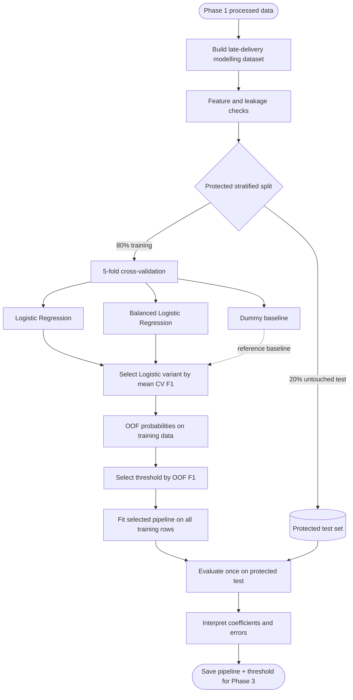

# Phase 2 — Negative Review Classification

This page explains the modelling workflow implemented by the canonical Phase 2 notebook and its supporting `src/classification_*.py` modules.

## Big Picture

**Question:** Among orders that were delivered late, which are likely to receive a negative review (1–2 stars)?

**Prediction point:** Immediately after a late delivery is completed and before the customer's review is known.

**Target:** `1` = review score 1–2; `0` = review score 3–5.

The implementation deliberately separates **model development** from the **protected final test**. Model configuration and the operating threshold are chosen using training data only. The untouched test set is evaluated once after those decisions are frozen.

The value of this design is not simply that Logistic Regression is fitted. It creates a reproducible chain from a clearly defined prediction problem to a model whose selection, threshold and final evaluation are kept separate.

## What the Notebook Actually Runs

The notebook is intended to run from top to bottom:

1. Load `data/processed/order_level.csv` and `item_level.csv`.
2. Build one modelling row per eligible late, delivered, reviewed order.
3. Audit the target, modelling columns and review timing.
4. Restrict predictors to the explicit feature allow-list.
5. Create one stratified 80/20 training/test split with a fixed random seed.
6. Compare a Dummy baseline, standard Logistic Regression and class-weighted Logistic Regression using the same five stratified folds.
7. Select between the two Logistic Regression variants using mean cross-validated F1.
8. Generate out-of-fold probabilities from the selected variant and select the threshold that maximises training-only OOF F1.
9. Fit the selected pipeline on all training rows and evaluate it once on the protected test set.
10. Inspect coefficients, odds ratios and protected-test errors.
11. Save the fitted pipeline and selected threshold as `deployment/negative_review_logistic_pipeline.pkl`, then reload it for an inference smoke test.

The notebook produces the evidence. Conclusions about whether the resulting model is useful should be written only after reviewing the actual run outputs.

## Under the Hood

### 1. Build the modelling population

`build_classification_dataset()` reuses the Phase 1 analytical tables rather than rebuilding general data cleaning. Eligible rows must be delivered, have a customer-delivery timestamp, have `late_delivery_flag == 1`, and have a review score.

Phase 1's sign convention is retained: positive `days_early` means early, zero means on time and negative means late. The builder checks that `late_delivery_flag` agrees with that convention.

The target is retrospective: review scores 1–2 become `is_negative_review = 1`; scores 3–5 become `0`.

### 2. Prevent leakage

The model does not receive review IDs, review text or review timestamps. IDs used for tracing and joins are also excluded from `X`.

Predictors are explicitly allow-listed in `NUMERIC_FEATURES` and `CATEGORICAL_FEATURES`. This means a new upstream CSV column cannot silently become a model feature.

Delivery performance can be used because the defined prediction happens **after delivery is completed**. Changing that prediction point would require a new feature review.

### 3. Keep learned preprocessing inside the Pipeline

Deterministic item aggregation happens before modelling. Learned transformations do not.

For numeric features, the Pipeline learns median imputation and standardisation. For categorical features, it learns most-frequent imputation and one-hot encoding. Because these transformations live inside the scikit-learn Pipeline, every cross-validation fold learns them from that fold's training rows rather than from the full dataset.

### 4. Protect the final test set

The data is split once using `train_test_split(..., test_size=0.20, stratify=y, random_state=42)`.

Stratification preserves the target-class proportion in both partitions. The 20% test partition is not used for feature decisions, model selection or threshold selection.

### 5. Establish a baseline

`DummyClassifier(strategy="prior")` provides a no-skill reference. It learns the class prior rather than relationships between predictors and the outcome.

Its purpose is to show what performance looks like without useful predictive relationships. The Logistic Regression results should therefore be interpreted relative to this baseline rather than in isolation.

### 6. Compare Logistic Regression configurations

The notebook compares:

- standard Logistic Regression;
- Logistic Regression with `class_weight="balanced"`.

Both use the same five-fold `StratifiedKFold` splits and the same preprocessing contract. The notebook records precision, recall, F1, balanced accuracy, PR-AUC and ROC-AUC for each configuration.

Only the two Logistic Regression variants participate in model selection. The variant with the higher **mean cross-validated F1** is selected. The Dummy model remains a reference baseline.

### 7. Select the operating threshold without touching the test set

The selected Logistic Regression configuration generates out-of-fold probabilities for the training rows using `cross_val_predict(..., method="predict_proba")`.

`threshold_table()` evaluates thresholds from 0.05 to 0.95. The implemented notebook selects the threshold with the highest OOF F1; ties favour the lower threshold.

This means both the model configuration and threshold are determined before the protected test set is opened.

### 8. Evaluate once on unseen data

The selected pipeline is fitted on all training rows and produces probabilities for the untouched test set.

`classification_metrics()` reports precision, recall, F1, balanced accuracy, PR-AUC and ROC-AUC. These are the final protected-test measurements. They are evidence for interpretation, not inputs for another round of tuning.

### 9. Interpret the Logistic Regression

For `is_negative_review = 1`, the notebook calculates:

`Odds Ratio = exp(Coefficient)`

and

`% Change in Odds = (Odds Ratio - 1) × 100`.

An odds ratio above 1 is associated with higher odds of a negative review; below 1 is associated with lower odds. Numeric predictors are standardised, so their coefficients correspond to a one-standard-deviation increase while the other model variables are held fixed.

These are associations, not causal effects.

### 10. Inspect errors

The protected-test rows are labelled as correct, false negative or false positive. This supports discussion of where the model fails without using those errors to retune the protected evaluation.

### 11. Save the Phase 3 artifact

`save_inference_artifact()` stores the fitted Pipeline, selected threshold, model-feature contract, prediction point and metadata in a versioned Joblib bundle.

The notebook reloads that artifact and scores one held-out-shaped row using `predict_from_artifact()`. This checks the inference interface; it is not another model-quality test.

## Deployment Flow

Phase 2 separates **training** from **serving predictions**. The notebook is responsible for fitting and validating the model. The deployment layer should load the frozen artifact rather than retraining the model whenever a prediction is requested.

```mermaid
flowchart LR
    A[Phase 2 notebook] --> B[Train + evaluate]
    B --> C[(negative_review_logistic_pipeline.pkl)]
    C --> D[Phase 3 FastAPI service]
    D --> E[POST /predict]
    E --> F[Validate incoming order features]
    F --> G[Saved preprocessing pipeline]
    G --> H[Logistic Regression probability]
    H --> I[Apply saved threshold]
    I --> J[Prediction response]
```

### What crosses the Phase 2 → Phase 3 boundary

The deployment artifact is `deployment/negative_review_logistic_pipeline.pkl`. Following the lecturer's convention, it uses a `.pkl` model file and keeps **Preprocessor + Model in ONE pipeline file**. It packages the fitted preprocessing and Logistic Regression pipeline together with the selected probability threshold, expected feature contract, prediction point and supporting metadata.

This is important because Phase 3 should not recreate preprocessing independently. A request should be transformed using the **same fitted imputation, scaling and one-hot encoding** learned during Phase 2 before Logistic Regression calculates the negative-review probability.

The current GitHub Actions workflow executes the canonical notebook and preserves both:

* the executed notebook, which contains the modelling evidence and outputs;
* `negative_review_logistic_pipeline.pkl`, which is the deployable model artifact.

These are uploaded as CI artifacts rather than committing the generated binary model into Git history.

### Phase 3 FastAPI handoff

For the current project direction, Phase 3 stops at a thin FastAPI model-serving layer:

1. start the API and load the approved `.pkl` artifact;
2. accept the required order features at a prediction endpoint such as `POST /predict`;
3. validate the request against the model's feature contract;
4. call the saved inference pipeline to obtain the negative-review probability;
5. apply the saved Phase 2 threshold;
6. return the probability and predicted class.

FastAPI therefore **serves** the trained model; it does not train, select or tune it. Model development remains in Phase 2, while FastAPI consumes the frozen artifact for inference.

For now, this workflow intentionally stops at the FastAPI serving boundary. No separate UI layer is part of this design.

## Feature Contract

The exact current feature lists in `src/classification_data.py` are authoritative.

| Information | Treatment | Why |
| --- | --- | --- |
| Review score | Target only | Constructs the retrospective binary outcome |
| Review ID, comments and timestamps | Excluded | Outcome-side leakage |
| Order/customer/product/seller IDs | Excluded | Trace/join keys; avoid entity memorisation |
| `order_status`, `late_delivery_flag` | Cohort filter only | Constant by construction within the modelling population |
| Delivery durations and `days_early` | Predictor | Delivery performance is known at the prediction point |
| Item/value/freight/seller counts | Predictor | Order composition and value |
| Payment totals/count/installments | Predictor | Payment characteristics |
| Customer/seller geography | Predictor | Coarse geography without entity IDs |
| Purchase month/weekday | Predictor | Temporal context |
| Primary product category | Predictor | Deterministic highest-value category |
| Mean product weight/volume/photo count | Predictor | Order-grain product characteristics |

## Outputs to Review After a Successful Run

A successful notebook execution means the technical classification pipeline has been built end to end. The analysis is academically complete only after the team reviews the generated evidence: target balance, CV comparison against the Dummy baseline, selected Logistic Regression configuration, selected OOF threshold, protected-test metrics, coefficient/odds-ratio interpretation and error patterns.

Poor predictive performance is still a valid result. The protected test should not be used to repeatedly tune the model until a preferred result appears.
