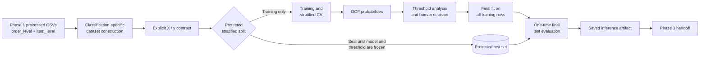
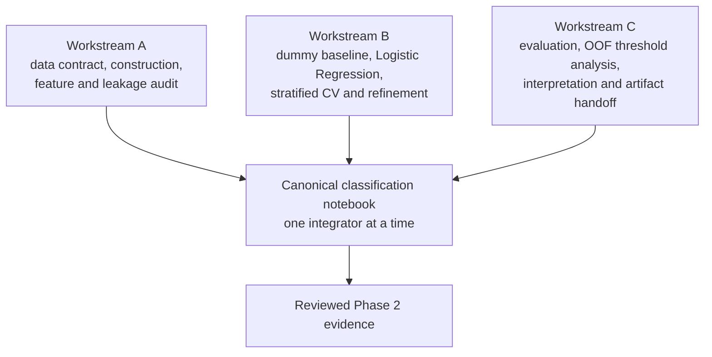

# Phase 2 classification workflow

## Big Picture

Phase 2 frames customer-experience risk as: **after an order reaches the customer,
will its eventual review be negative (1 or 2 stars)?** The customer-experience team
could use the probability to prioritise proactive support while there is still time
to resolve a poor experience. The prediction point is deliberately after delivery and
before review submission. Delivery performance can therefore be used, but nothing from
the review except its score may enter target construction.

The first model family is Logistic Regression. It is suitable as a transparent course-level
baseline, supports probability estimates and allows coefficient/odds-ratio interpretation.
This foundation does not report a fitted result or select a final threshold: those are team
analytical decisions that must be produced by running and reviewing the canonical notebook.
No second classification model family is introduced here.

Phase 1 already provides cleaned analytical CSVs at order and item grain. Phase 2 adds a
classification-only model table, a leakage-safe sklearn pipeline, evaluation/threshold
helpers, and a versioned inference bundle contract. It does **not** rebuild general Phase 1
cleaning, consume `dashboard_orders.parquet`, or implement the Phase 3 application.

## Inputs and Outputs

| Component | Receives | Returns / persists |
| --- | --- | --- |
| `build_classification_dataset` | Phase 1 `order_level.csv` (one row/order) and `item_level.csv` (one row/order item) | One row per eligible delivered, reviewed order; trace-only `order_id`, explicit model features, binary target |
| `split_features_target` | Contracted classification dataset | `X` containing only the allow-listed features and binary `y` |
| `build_preprocessor` | Numeric and categorical columns named in `classification_data.py` | Unfitted `ColumnTransformer`; median imputation/scaling and mode imputation/OHE are learned only during fitting |
| `build_logistic_pipeline` | Contracted feature frame at `.fit()` | Unfitted end-to-end Logistic Regression pipeline |
| Evaluation helpers | True labels and probabilities from validation/OOF folds | Metric dictionary, threshold comparison table, or optional statistical candidate; no automatic operating decision |
| `save_inference_artifact` | Reviewed fitted pipeline, training-only selected threshold and optional provenance | Joblib dictionary with schema version, exact feature contract, prediction point and metadata |
| `predict_from_artifact` | Loaded artifact and one or more model-feature rows | Negative-review probability and thresholded prediction |

The authoritative detailed dataset contract is the `build_classification_dataset()`
docstring. The inference artifact should only be produced after the team has frozen the
model, threshold and provenance metadata (for example, data version, commit and metrics).
Model binaries are generated outputs and are not added by this foundation PR.

## Under the Hood

### Eligibility, grain and target

- Eligible examples are delivered orders with a non-null customer-delivery timestamp and
  deduplicated review score. This is the retrospective population needed to construct the
  target; review-answer timing does not silently remove otherwise usable observations.
- `review_timing_audit()` separately counts missing, unparseable, at/before-delivery and
  after-delivery review answers. These outcome-side fields support data-quality discussion
  only and are never predictors.
- `order_id` must be unique in the order input; (`order_id`, `order_item_id`) must be unique
  in the item input; every eligible order must have item coverage.
- Review score must be one of 1–5. Scores 1–2 map to target 1; scores 3–5 map to target 0.
- Both target classes must be present. Required columns, duplicate keys and infinite numeric
  values fail early rather than silently changing the modelling population.

### Features and leakage controls

Features are allow-listed as `NUMERIC_FEATURES` and `CATEGORICAL_FEATURES`; the code never
uses “all columns except target.” IDs and post-review fields cannot silently enter the model
when an upstream CSV gains a column. Order-level payment, geography, temporal, value and
delivery features are combined with deterministic item-derived product summaries. A
multi-category order uses the category with greatest item value, with alphabetical tie-break.

Deterministic business transformations occur before splitting because they learn no sample
statistics. Median/mode imputation, scaling and one-hot category discovery remain inside the
sklearn Pipeline, so cross-validation fits them separately in each training fold.

The test partition must be created once with a fixed seed and target stratification, then
left untouched until all refinement and threshold choices are complete. Threshold selection
uses out-of-fold probabilities from training data only. Accuracy is not a sufficient primary
metric for an imbalanced target; compare precision, recall, F1, balanced accuracy and PR-AUC,
with ROC-AUC as supporting context. The business cost of missed negative reviews versus
unnecessary outreach must determine the final selection rule.

`threshold_table()` is the primary analysis interface. `best_threshold_by_metric()` may
identify a statistical candidate, such as the maximum-F1 row, but it does not select the
operating threshold. The team must make and document that decision from stakeholder costs;
the protected test set cannot participate in it.

### Feature contract and audit

This table covers the actual Phase 1 fields used to construct the current allow-list and the
important exclusions. Grouped rows share the same treatment and rationale; the exact model
columns remain authoritative in `NUMERIC_FEATURES` and `CATEGORICAL_FEATURES`.

| Feature | Source | Treatment | Available at prediction point? | Model input? | Reason |
| --- | --- | --- | --- | --- | --- |
| `review_score` | `order_level` / deduplicated reviews | Target only | No | Target only | Constructs 1 for scores 1–2 and 0 for 3–5; never enters `X` |
| `review_id`, review comments | `order_level` / reviews | Excluded leakage | No | No | Exist only with the review outcome and could reveal it |
| `review_creation_date`, `review_answer_timestamp`, `days_to_review_request` | `order_level` / reviews | Excluded leakage | No | No | Outcome-side timing is audit context, not predictive input |
| `order_id` | `order_level` | Excluded identifier | Yes | No | Retained only to trace errors and joins |
| `customer_id`, `customer_unique_id`, `product_id`, `seller_id` | processed source tables | Excluded identifier | Yes | No | High-cardinality entity keys risk memorisation and are not deployable signals here |
| `order_status` | `order_level` | Excluded constant/non-useful | Yes | No | Eligibility fixes the modelling population to delivered orders |
| Raw purchase, approval, carrier, delivery and estimate timestamps | `order_level` | Derived then excluded | Varies | No | Human-readable timestamps are transformed into reviewed temporal/duration fields |
| `delivery_days`, `estimated_delivery_days`, `days_early` | `order_level` | Derived | Yes | Yes | Delivery performance is known at the after-delivery prediction point |
| `item_count`, `order_item_value`, `order_freight_value`, `freight_share`, `seller_count` | `order_level` | Derived | Yes | Yes | Order composition/value information is known before delivery |
| `payment_total`, `payment_count`, `max_installments` | `order_level` | Derived | Yes | Yes | Aggregated payment characteristics are available before delivery |
| `customer_state`, `seller_state`, `same_state`, `n_seller_states` | `order_level` | Direct/derived | Yes | Yes | Coarse geography and route complexity without entity IDs |
| `purchase_month`, `purchase_weekday` | `order_level` | Derived | Yes | Yes | Captures temporal/seasonal context without raw timestamps |
| `primary_product_category` | `item_level` | Derived | Yes | Yes | Highest item-value category with deterministic alphabetical tie-break |
| Product weight, dimensions and photo count | `item_level` | Derived | Yes | Yes | Aggregated to mean weight, volume and photo count at order grain |
| Product-name/description lengths | `item_level` | Excluded non-useful | Yes | No | Not selected for the initial, focused Logistic Regression contract |

### Dummy baseline

`DummyClassifier(strategy="prior")` is a no-skill reference: it learns the class prior, not
predictive relationships between features and the target. It retains the same preprocessing
pipeline for interface consistency and a like-for-like CV call. The fitted transformations
do **not** make the Dummy classifier feature-informed.

## Three-person parallel workflow

Use one canonical notebook: `notebooks/phase2_negative_review_classification.ipynb`.
Do not copy it per teammate. Each workstream should use its own branch and primarily edit
the owned files below; integration into the notebook happens in short, reviewed commits.

| Owner / workstream | Primary ownership | Interface to the others |
| --- | --- | --- |
| A — data contract and audit | `src/classification_data.py`; dataset/target and leakage-audit evidence | Publishes `OUTPUT_COLUMNS`, feature lists, eligibility counts and documented data issues; does not change model settings |
| B — modelling and validation | `src/classification_model.py`; notebook split, dummy baseline, Logistic Regression and stratified CV sections | Consumes only `split_features_target()` output; publishes reproducible CV/OOF tables and candidate pipeline settings; does not edit dataset logic silently |
| C — evaluation, interpretation and handoff | `src/classification_evaluation.py`; notebook threshold, test, coefficient, errors and artifact sections | Consumes frozen OOF/test predictions plus fitted pipeline; publishes threshold rationale, final evaluation, interpretation and artifact metadata |

### Coordination rules

1. Agree on prediction point, target and feature contract before fitting. Contract changes
   require review from all three workstreams.
2. Assign one notebook integrator at a time. Other teammates contribute modules, tests,
   small result tables or Markdown proposals rather than concurrent notebook edits.
3. Never use the protected test labels to refine features, class weights, hyperparameters or
   threshold. Record each decision and its training/CV evidence.
4. Merge data-contract work first, modelling second, and evaluation/handoff third. Re-run the
   complete notebook after each interface change and clear stale outputs before review.
5. Humans must review, understand and validate AI-assisted code and analytical conclusions,
   and declare AI use where required by the course.

## Remaining Phase 2 work

- Execute and review dataset/target audits against the shared Phase 1 CSVs.
- Freeze the allowable predictors after a feature-availability and leakage review.
- Establish dummy and default Logistic Regression results with stratified CV.
- Refine only the Logistic Regression approach initially (for example class weight or
  regularisation), recording each comparison rather than trying unrelated algorithms.
- Generate training-only OOF probabilities and justify a stakeholder-appropriate threshold.
- Evaluate exactly once on the protected test set; add confidence/variability context.
- Interpret coefficients/odds ratios carefully, including one-hot reference categories and
  the difference between association and causation; perform structured error analysis.
- Save the approved artifact, reload it and run the documented inference smoke test.
- Hand the artifact schema and prediction-point limitations to Phase 3; build no API until
  the analytical decisions are approved.
